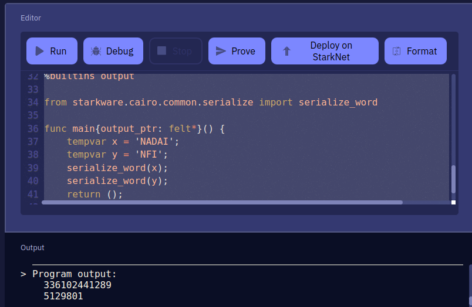

# Nadai ERC721 en StarkNet con Protostar

El tutorial a realizar es una guía de como instalar Protostar, la usaremos para realizar un Deploy que un implemente un contrato ERC721 personalizado en la red de prueba `Goerli` mediante Protostar, inspirado en el documento oficial [ERC721 Starknet-edu](https://github.com/starknet-edu/starknet-erc721.git)

[ERC721](https://github.com/omarespejel/starknet-erc721-testing.git)

El contrato [ERC721Custom](https://github.com/omarespejel/starknet-erc721-testing.git) nos permite acuñar animales con características como alas, patas y sexo.

## Resumen del tutorial
Consiste en instalar Protostar, una herramienta que administra sus dependencias, compila su proyecto y ejecuta pruebas. 

* Puede revisar su [Documentación Oficial](https://docs.swmansion.com/protostar/) 
* Asi como [Recursos Adicionales](https://blog.swmansion.com/testing-starknet-contracts-made-easy-with-protostar-2ecdad3c9133)
* Recomendacion de [Henri explica como realizar el tutorial ERC721](https://www.youtube.com/watch?v=PJWIgIoj5kw)

Usaremos el ERC721 importado para hacer el deploy en testnet, crear nuestro primer NFT de la colección con las carateristicas de estos animales que veremos en el tutorial. También nos servirá de práctica para los ejercicios [ERC721 Starknet-edu](https://github.com/starknet-edu/starknet-erc721.git) que luego en el contrato evaluador podremos añadir el address del contrato que estuvimos trabajando. Y de esta forma obtener puntos y seguir avanzando.

## Requisitos

- buen conocimiento de [Python](https://www.python.org/)
- buen conocimiento de [pytest](https://docs.pytest.org/en/7.1.x/)
- conocimientos básicos de [Cairo and StarkNet](https://www.cairo-lang.org/docs/index.html)
- conocimientos básicos de [mypy](https://mypy.readthedocs.io/en/stable/getting_started.html)
 
## Instalación

Primero instalaremos `curl` y el repositorio que trae las herramientas. Copie y ejecute en una terminal los siguientes comandos

```bash
sudo apt install curl
```

```shell
curl -L https://raw.githubusercontent.com/software-mansion/protostar/master/install.sh | bash
```

Si desea especificar una versión, ejecute el siguiente comando con la versión solicitada:

```console
curl -L https://raw.githubusercontent.com/software-mansion/protostar/master/install.sh | bash -s -- -v 0.3.2
```
Reinicie la terminal. Luego procedemos ha comprobar la versión de Protostar y Cairo Lang.

```bash
protostar -v
```
Saldrá un mensaje de versión actualizado similar a este:

Protostar version: 0.4.2                                                                            
Cairo-lang version: ^0.10.0                                                                          
21:38:49 [INFO] Execution time: 3.43 s                                                               

Para actualizar Protostar, ejecute:

```bash
protostar upgrade
```
----

## Inicialización del proyecto

Para crear un nuevo proyecto ejecute:

```bash
protostar init
```
A continuación les pedirá un nombre para el proyecto, escríbalo y dele a continuar, se le creará
varias carpetas y protostar.toml. Ahora le haremos un test con los siguientes comandos:

```bash
protostar -p ci test
```

22:43:16 [INFO] Test suites: 1 passed, 1 total                                                       
22:43:16 [INFO] Tests:       2 passed, 2 total                                               
22:43:16 [INFO] Seed:        822203972                                               
22:43:16 [INFO] Execution time: 10.92 s                                                         

El proyecto Protostar debe ser un repositorio git y tener `protostar.toml`, un archivo. Puede adaptar su proyecto manualmente o ejecutando 

```bash
protostar init --existing.
```

El resultado de la ejecución protostar inites un archivo de configuración protostar.toml, archivos de ejemplo y los siguientes 3 directorios:

src— Un directorio para su código.
lib— Un directorio predeterminado para dependencias externas.
tests— Un directorio que almacena pruebas.
protostar.toml— Un archivo principal que guardara rutas, e información principal.

## Configuración para crear ERC721

Primero instalaremos la repo que usaremos con el comando de la biblioteca de OpenZeppelin

```bash
protostar install https://github.com/OpenZeppelin/cairo-contracts.git
```

Nos deberia de imprimir una pantalla similar a esta

```bash
21:24:38 [INFO] Executing install                                                                                       
21:24:38 [INFO] Installing cairo_contracts_git (https://github.com/OpenZeppelin/cairo-contracts.git)
21:24:40 [INFO] Installed successfully
21:24:40 [INFO] Execution time: 6.70 s
```

### Build al contrato

En este punto asegurarno de que estamos dentro de la carpeta instalada, sino nos lanzará un error. Una vez dentro realizamos

```bash
protostar build
```

Imprimirá algo similar a esto

```bash
18:26:24 [INFO] Built the project successfully                                                           
18:26:24 [INFO] Execution time: 24.21 s
```

### Convertir string a int

Puede convertir un string en un int utilizando el editor online https://www.cairo-lang.org/playground/ 

Utilice el siguiente código y modifique los valores que desee añadir, luego presione Run y copie los `outpout` obtenidos.

```bash
%builtins output

from starkware.cairo.common.serialize import serialize_word

func main{output_ptr: felt*}() {
    tempvar x = 'NADAI';
    tempvar y = 'NFI';
    serialize_word(x);
    serialize_word(y);
    return ();
}
```



## Realizar el deploy en tesnet Goerli

Para realizar el deploy del ERC721 necesitamos pasarle parámetros nombre, símbolo, y un address.
El address en el caso de querer hacer los ejercicios de [ERC721 Starknet-edu](https://github.com/starknet-edu/starknet-erc721.git)tiene que añadir la del contrato evaluador que es `x2d15a378e131b0a9dc323d0eae882bfe8ecc59de0eb206266ca236f823e0a15`. En esta prueba hemos añadido nuestra Smart Wallet de Argent X

Para el nombre y el simbolo debemos convertir los string en int. Si queremos hacer el deploy del ERC721 con los Oficiales sería

nombre = 'STARKNET' = 6004496024898258260
símbolo = 'STARK' = 357895852619

Quedaría de la siguiente manera

```bash
protostar deploy ./build/ERC721.json --network alpha-goerli -i 6004496024898258260 357895852619 0x2d15a378e131b0a9dc323d0eae882bfe8ecc59de0eb206266ca236f823e0a15
```

En el caso de esta repo ha sido 

```bash
protostar deploy ./build/ERC721_custom.json --network alpha-goerli -i 336102441289 5129801 0x03F878C94De81906ba1A016aB0E228D361753536681a776ddA29674FfeBB3CB0
```

Listo ya realizo el deploy de su contrato de [ERC721Custom](https://goerli.voyager.online/contract/0x034dc30bb1aac030dca1e13be37728087bb49be818efb5ca7deb0aab26732e96#readContract). Ahora desde él podremos crear nuestro primer NFT.

## Mint primer NFT

En el contrato deployado, vamos a write smart y en el punto uno `declare_animal` especificamos los valores `1,2,1`


¡¡¡FELICIDADES!!!Si todo ha ido bien, su primer NFT ha debido de ser deployado en este caso [NFI](https://goerli.voyager.online/tx/0x5f4400220df5eb23eea343ccaef04d396ee7368095f7a021f6608ae23027249#overview)
Podrá verlo en su wallet Argent X, en la parte collectibles y abrirlos con [MINTSQUARE](https://mintsquare.io/asset/starknet-testnet/0x034dc30bb1aac030dca1e13be37728087bb49be818efb5ca7deb0aab26732e96/1) o con [ASPECT](https://testnet.aspect.co/asset/0x034dc30bb1aac030dca1e13be37728087bb49be818efb5ca7deb0aab26732e96/1)
